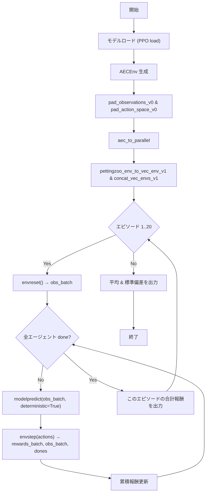

# evaluate_independent.md

## プログラム概要

Pythonプログラム `evaluate_independent.py` の仕様と使用方法について説明します。

---

## ファイル名

`evaluate_independent.py`

---

## 機能概要

- AEC 環境を生成 (simple_tag_v3.env)
- 空間パディング
- AEC→Parallel 変換
- VecEnv 化
- 学習済みモデルをロード
- 20 エピソード分、決定論的にモデルを評価し累積報酬を出力
- 最終的に平均報酬と標準偏差を表示

---

## 前提知識

- PettingZooやStable Baselines3などのマルチエージェント強化学習環境に関する基本的な理解。
- Pythonの基本的な文法とライブラリの使用方法
- Supersuitで観測・行動空間をパディングして、エージェントの行動をラップする方法
- Stable-Baseline3のPPOモデルによる決定論的評価

## 使用方法

1. 必要なライブラリをインストールする。

```bash
    pip install -r requirements.txt
```

2. プログラムを実行する。

```bash
    python evaluate_independent.py --input <input_file> --output <output_file>
 ```

---

## 引数

- `--input`: 評価対象の入力ファイルを指定します。
- `--output`: 評価結果を保存する出力ファイルを指定します。

---

## 出力

- 評価結果が指定された出力ファイルに保存されます。

---

## 注意事項

- 入力ファイルは正しいフォーマットである必要があります。
- 必要に応じて設定ファイルを編集してください。

---

## 疑似コード

```python
1. モデルパスを指定して PPO モデルをロード
2. AEC 環境を simple_tag_v3.env(...) で生成
3. pad_observations_v0／pad_action_space_v0 で観測・行動空間を揃える
4. aec_to_parallel() で Parallel API に変換
5. pettingzoo_env_to_vec_env_v1／concat_vec_envs_v1 で VecEnv に
6. for ep in 1..20:
     a. VecEnv.reset() → obs_batch
     b. done = [False×n_agents]
     c. while not all(done):
          i. actions = model.predict(obs_batch, deterministic=True)
         ii. obs_batch, rewards_batch, terminations, truncations, _ = env.step(actions)
        iii. 累積報酬を加算
         iv. done = termination OR truncation
     d. 合計報酬をプリント & リストに保存
7. 全エピソード終了後、平均＆標準偏差をプリント


```

## アルゴリズムの説明



## アルゴリズム採用の理由

- 決定論的評価
  - Deterministic = trueとすることでポリシーの純粋な性能を評価し，モデルの安定度を測定
- 複数エピソードでの統計的評価
  - 単一エピソードだと運の要素が強くなるため，平均と標準偏差をだすことでばらつきを定量化
- VecEnvの採用
  - Supersuit + VecEnvの組み合わせでPettingZoo parallel_EnvをそのままSB3に流し込み，評価用コードをシンプルに保つ
- PPOとの親和
  - 学習にPPOを使ったので，同じAPIによる評価が最も実装コストが小さく確実．

## ライセンス

このプログラムはMITライセンスの下で提供されています。

---

## 著者

- 名前: [Your Name]
- メール: [Your Email]