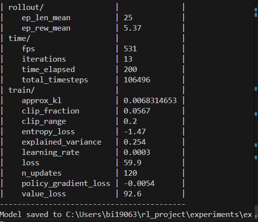
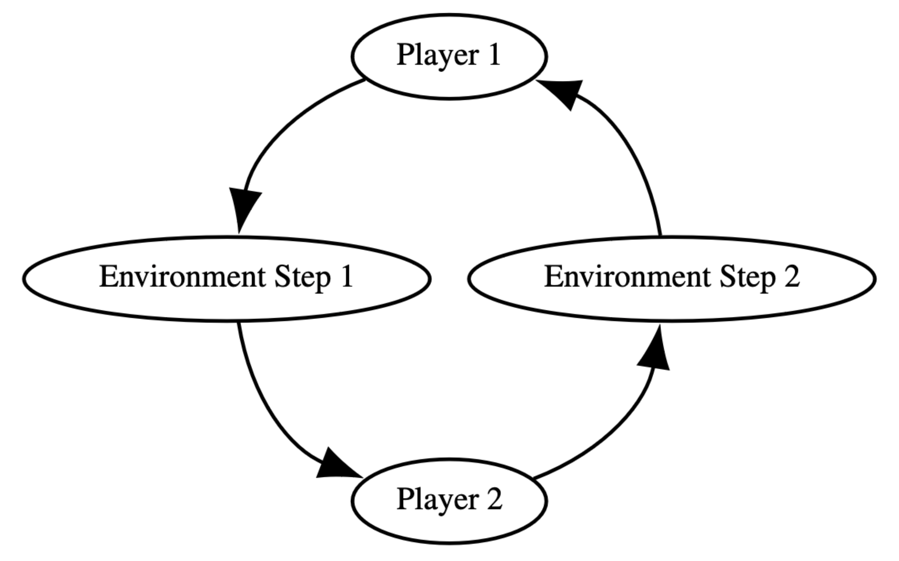

# pettingzooについての調査

## PettingZooとは

マルチエージェント強化学習については[こちら](マルチエージェント強化学習.md
)を参照してください

マルチエージェント強化学習環境セットである．（Pythonで動く）
OpenAIGymのマルチエージェント版の様なもの

[Stable Baselines](Stable_Baselines.md)（強化学習アルゴリズム実装セット）や[SuperSuit](SuperSuit.md
)（強化学習環境をラップして前処理を行う関数群）を併用する．

学習中は以下の画像のように学習状況が出力される．


## APIについて

細かいことは[公式ドキュメント](https://pettingzoo.farama.org/api/aec/#about-aec)を読みましょうね（結構たくさん書いてありますよ～）

学習環境の初期化

``` Python
from pettingzoo.butterfly import pistonball_v6
env = pistonball_v6.env()
```

主なメソッド

- agent_iter()：
  - 現在のエージェントを生成するIteratorを返す，全エージェントがエピソード完了時，または最大ステップ実行時に終了．
- last(observe = True )：
  - 現在行動可能なエージェントの観察，報酬，エピソード完了，情報を返す．
    報酬はエージェントが最後に行動してから受け取った累積報酬．
- reset():
  - 学習環境をリセット
- step(action):
  - 学習環境内のエージェント行動w1ステップ実行し，次のエージェント制御に切り替える．

### Additional API

あらゆるマルチエージェント強化学習に対応するために，非常に低レイヤーの関数や属性も用意してある．

agents, num_agents, agent_selction, done, infos, observe(agent), rewards, seed, render(), close()などなど


### Agent Environment Cycle（AEC）について

pettingzooはAECとして設計されている．
AEC環境の中では，エージェントは連続的に行動し，環境からの観察や報酬を行動を選択する前に受け取る．環境はエージェントの行動が行われるたびに，それを反映するアップデートが行われる．
マルチエージェント強化学習を扱うのに，向いているモデルの一つである．



※　他には，エージェントが同時に行動し，観測や報酬を最後にまとめて受け取る[POSGモデル](POSGモデル.md)や，ゲームのすべての行動の組み合わせを木構造として明示的に表現する[EFGモデル](EFGモデル.md
)がある．
AECモデルは順番性が強く，複雑な環境や進化的ルールを表現することに向いている．

## 参考文献リスト

- [PettingZoo入門(1) マルチエージェント入門](https://note.com/npaka/n/n9b9074b8f916)
- [PettingZoo入門(2) マルチエージェント入門](https://note.com/npaka/n/n06d8ba36d5bc)
- [PettingZoo Documentation](https://pettingzoo.farama.org/index.html)
- [マルチエージェント強化学習環境PettingZoo紹介 ](https://www.toolify.ai/ja/ai-news-jp/%E5%BC%B7%E5%8C%96%E5%AD%A6%E7%BF%92%E7%92%B0%E5%A2%83pettingzoo%E7%B4%B9%E4%BB%8B-592521)