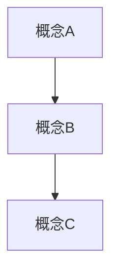

# 概念調査レポート : title
- **作成日**: <!-- 例: 2025-08-08 -->
- **作成者**: <!-- 氏名・担当 -->
- **版数**  : <!-- v1.0 / Draft など -->

---

## 1. 調査の目的
| 項目 | 内容 |
|------|------|
| 背景 | <!-- なぜこの概念を調べるのか。業務・研究との関連性などを簡潔に記載 --> |
| 目的 | <!-- このレポートで明らかにしたいこと（例: 概念理解、適用可能性検討、比較資料作成 等） --> |
| 想定読者 | <!-- 開発チーム / 研究メンバー / マネージャ / 学術関係者 など --> |

---

## 2. 概要
- **概念名** : <!-- 概念・理論の正式名称（和名・英名両方） -->
- **定義** : <!-- 信頼できる出典に基づく定義 -->
- **分野** : <!-- 機械学習 / ゲーム理論 / 認知科学 / 経済学 など -->
- **主要用途 / 目的** : <!-- この概念が使われる場面や目的 -->
- **関連用語** : <!-- 同義語や関連概念 -->

---

## 3. 歴史・発展経緯
| 年 | 出典 / 出来事 | 内容 |
|----|---------------|------|
| <!-- 例: 1950 --> | <!-- John Nash によりゲーム理論の均衡概念提唱 --> | <!-- 内容 --> |

---

## 4. 概念の構造 / 枠組み
- **主要構成要素** : <!-- サブ概念や構成因子 -->
- **関係性図** :  

- **数理モデル / 論理構造** : <!-- 式や論理図があれば -->

---

## 5. 特徴と要点
| 観点 | 内容 | 利点 / 強み | 注意点 / 制約 |
|------|------|-------------|---------------|
| 理論的特徴 | | | |
| 実践的特徴 | | | |

---

## 6. 関連理論・モデル
| 名称 | 関係性 | 相違点 / 類似点 |
|------|--------|----------------|
| <!-- 概念X --> | <!-- 競合 / 補完 / 発展形 など --> | |

---

## 7. 適用事例
| 分野 / ドメイン | 具体的事例 | 成果 / 課題 |
|----------------|-----------|-------------|
| | | |

---

## 8. 評価指標 / 評価方法
- **評価の観点** : <!-- 効果、妥当性、再現性、説明可能性 等 -->
- **測定手法** : <!-- 定量・定性評価の方法 -->

---

## 9. メリット・デメリットまとめ
### メリット
-  
### デメリット / 課題
-  

---

## 10. 競合 / 代替概念
| 概念 | 特徴 | 比較ポイント |
|------|------|--------------|
| | | |

---

## 11. 調査時の留意点
| リスク | 想定影響 | 対応策 |
|--------|----------|--------|
| 誤った定義の引用 | 誤解・適用ミス | 出典明記・複数文献参照 |
| 分野間の用語差異 | コミュニケーション齟齬 | 定義を冒頭で明示 |

---

## 12. 今後の展望 / 調査課題
- 関連分野での最新研究動向収集  
- 応用事例の横断的比較  
- モデル拡張の理論的検証  

---

## 13. 参考文献
1. <!-- 書籍 / 論文 / Web サイト -->
2.  
3.  

---

## 付録
### A. 数理モデル式・証明
### B. 用語集
